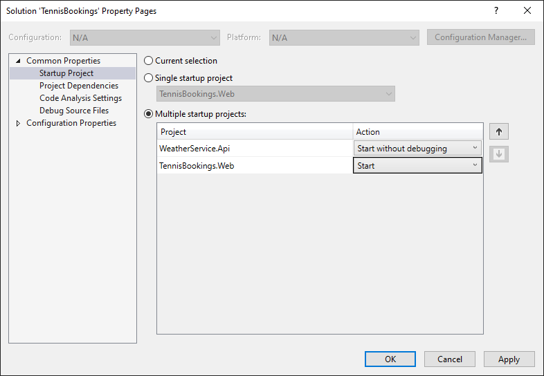

# Dependency Injection in ASP․NET Core

This download contains a Visual Studio solution and the project files.

The before/after samples for this course use ASP․NET Core 2.2 which is no longer supported by Microsoft. However, the code shown will also work in newer 3.1 and 5.0 releases. The samples remain in 2.2 to align with the video content.

As an example, the "Sample Application 3.1" folder also contains an ASP.NET Core 3.1 application representing the final state of the application (requires the 3.1 SDK or newer).

# Prerequisites

- .NET Core SDK 2.2+ (To follow along with the before and after solutions)
- Although it out of support, you will require the ASP.NET Core and .NET Core runtimes for the latest 2.2.x release. Download these from [the Microsoft website](https://dotnet.microsoft.com/download/dotnet-core/2.2).
- Visual Studio 2019 or alternative editor

# Configuration Steps Required to Run Sample

1: Open the TennisBookings.sln in Visual Studio.

*If prompted with a security warning, deselect "Ask me for ever project in this solution" and click "OK".*

2: Set multiple startup projects...

- Right click on the solution and choose "Set Startup Projects".

- Choose "Multiple startup projects"

Set `WeatherService.Api` as "Start without debugging" and `TennisBookings.Web` as "Start".

- Ensure `WeatherService.Api` is moved to the top of the list.

- Click "OK" to close the solution properties window.

## Credentials

To login to the Tennis Booking web application as an administrator, use the following credentials.

- Username = admin@example.com
- Password = Password1!

To login to the Tennis Booking web application as a member, use the following credentials.

- Username = member@example.com
- Password = Password1!

# Troubleshooting

** BUILD ERROR: "'dotnet.exe' has exited with code -2147450749".

This is caused by changed in the latest versions of Visual Studio and the .NET SDK which no longer set a required environment variable. You can resolve this by ensuring the DOTNET_HOST_PATH environment variable is set to the path of your dotnet.exe which by default is "%ProgramFiles%\dotnet\dotnet.exe" on Windows.

To set this from a Windows CMD line:

`setx DOTNET_HOST_PATH "%ProgramFiles%\dotnet\dotnet.exe"`